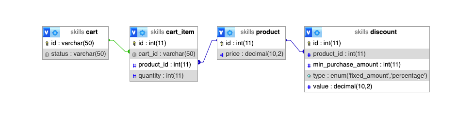

import { Highlight } from '@skills17/competitor-readme';

# Shopping Cart API

Your task is to create an API implementing a shopping cart. The API should allow users to create a new shopping cart,
add items to the cart, update the quantity of items in the cart, remove items from the cart, view the contents of the
cart, and checkout the cart.

## Table of Contents

- [Introduction](#introduction)
- [Database](#database)
- [Tests](#tests)
- [Development Environment](#development-environment)
- [API](#api)

## Introduction

Your task is to create an API that always returns 404 Not Found

## Database

The database with the name `skills` has been prepared for you with a structure and data. A database dump is also
provided to you in `work/backend/dump.sql`. You can use the dump to reset your database to the original state, should
your database get damaged.

The tests assert that the original products and discounts in the dump exist in the database.
If you happen to delete or modify them, you need to reset your database manually, to make the tests able to pass.
If you never delete or modify the original tables and rows, you should not need to reset the database to make the tests pass.

You must not update the structure of the database. You can only update the data in the tables.

PHPMyAdmin is available at http://localhost:9000. The username is "admin" and the password is "admin".

The schema is as follows:

[](/api/images/backend/backend/readme/db-schema.png)

- `cart` - Contains the shopping carts created via the API you implement.
- `cart_item` - Contains the items in the shopping carts created via the API you implement.
- `product` - Contains the predefined products that can be added to the shopping carts.
- `discount` - Contains the predefined discounts that can be applied to the shopping carts.

The `discount.min_purchase_amount` specifies the minimum amount of a certain product that needs to be in the cart for
the discount to be applied. The `discount.type` specifies the type `fixed_amount` or `percentage`. The `discount.value`
specifies the value of the discount. The `discount.product_id` specifies the product that the discount applies to.

- `fixed_amount` - The discount is a fixed amount of money that is subtracted from the total price.
- `percentage` - The discount is a percentage of the price that is subtracted. The value is a number between 0 and 100.
The percentage only applies to the product that the discount is for. I.e. I have to order 3 of product A to get a 10%
discount on product A.

## Development Environment

You have been provided with boilerplate code to start coding. There are two setups:

- __Node.js with Express.js__ in `work/backend/src-node`.
  - You can start the server by running `npm start` in `work/backend/`.
  - Your code changes are automatically applied. You do not need to restart the development server.
  - Console outputs are logged into the **terminal window** where you run `npm start`.
- __PHP__ in `work/backend/src-php`.
  - You can start the development server by running `composer start` in `work/backend/`.
  - Your code changes are automatically applied. You do not need to restart the development server.
  - PHP warnings, errors, and exceptions are logged into the **terminal window** where you run `composer start`.

<Highlight type="warning">
  You can choose freely between those two and are only expected to solve it in
  one stack. Should you switch over mid-way, the final solution that gets more
  points will be the one that is taken into account. Points cannot be
  accumulated from both of the two solutions.
</Highlight>

<Highlight type="error">
  You can only change files under `work/backend/src-node/` or
  `work/backend/src-php/`. All other files and the database will be reverted for
  the review process.

  You are therefore also **not** allowed to install additional NPM or Composer packages.
</Highlight>

## Tests

To evaluate the API, you have been provided with a test suite written with Jest.

<Highlight type="warning">
  Before running the tests, ensure your server is running!
</Highlight>

To execute the tests, run the following command:

```shell
npm test
```

If your editor supports it, you can also run the tests from your editor.

<Highlight type="warning">
  There is an extra test suite, not available for you, that will also be used to
  evaluate your solution that contains the exact same tests, but different
  values in the URLs and expected responses. So, do not catch specific values or
  return hard-coded responses, as this will fail later.
</Highlight>

Making all tests pass is hard. Please be aware that this is not an exam where you get a grade. This is a competition where
you are ranked among each other.

## API

Your task is to implement the following API endpoints. The listing below should serve as a reference for the expected
behavior of the API. However, the tests are the definitive source of truth for the API behavior and should be used as
the primary reference.

### Create a Cart `POST /api/carts`

Create a new shopping cart for a user.

**Request Body:**

None

**Response:**
```
Status: 201 Created
{ "cartId": "123456789" }
```

### Add Item to Cart `POST /api/carts/{cartId}/items`

Add an item to the shopping cart.

**Request Body:**
```
{
  "productId": 1,
  "quantity": 2
}
```

**Response:**
```
Status: 201 Created
```

### Update Item Quantity in Cart `PUT /api/carts/{cartId}/items/{productId}`

Update the quantity of a specific item in the cart.

**Request Body:**
```
{
  "quantity": 3
}
```

**Response:**
```
Status: 200 OK
```

### Remove Item from Cart `DELETE /api/carts/{cartId}/items/{productId}`

Remove an item from the cart.

**Request Body:**

None

**Response:**
```
Status: 200 OK
```

### View Cart `GET /api/carts/{cartId}`

Retrieve the contents of the shopping cart.
If there are no discounts to be applied, the `discountedPrice` should be the same as the `originalPrice`.

**Response:**
```
Status: 200 OK
{
  "cartId": "123456789",
  "status": "open",
  "items": [
    {
      "id": 1,
      "quantity": 3,
      "price": 10.99
    },
    {
      "id": 2,
      "quantity": 1,
      "price": 24.99
    }
  ],
  "originalPrice": 56.95,
  "discountedPrice": 49.99
}
```


### Checkout `POST /api/carts/{cartId}/checkout`

Process the checkout for the items in the cart.

**Request Body:**

None

**Response:**
```
Status: 200 OK
{ "message": "Checkout successful. Order placed." }
```


#### Non-existing path `GET /non-existing`

**Response Body:**

```
Status: 404 Not Found
{ "error": "Route not found" }
```
